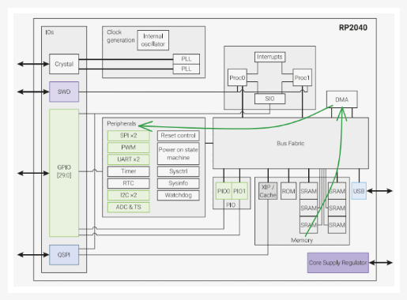
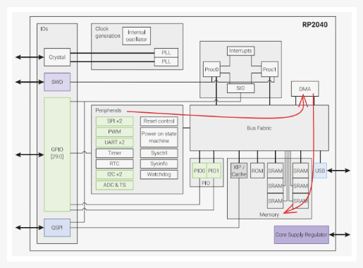
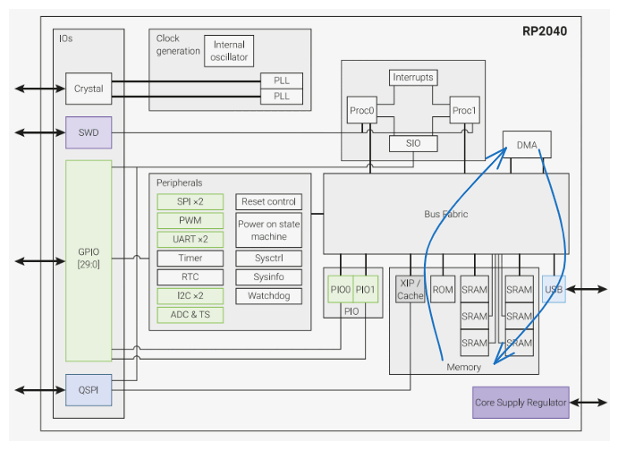
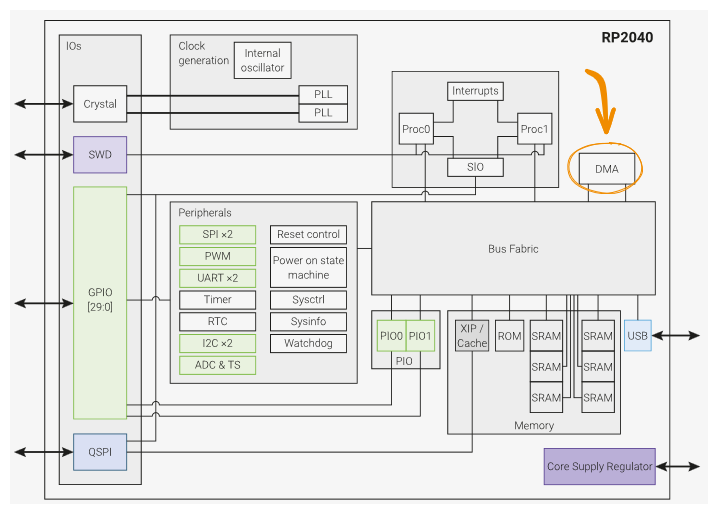
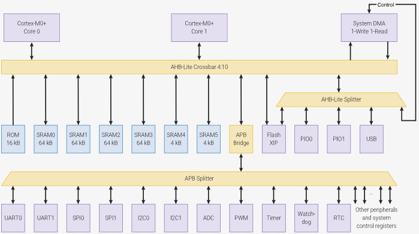
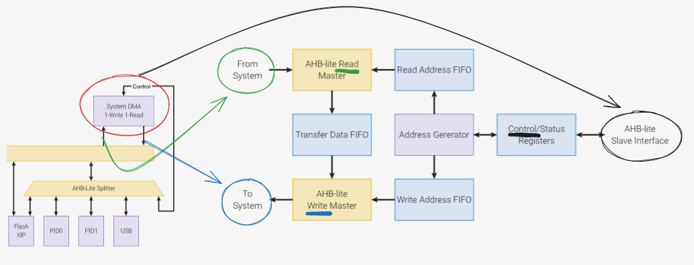
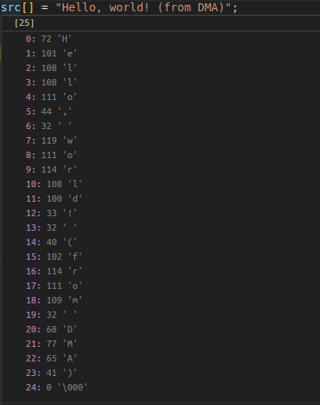

# DMA

DMA (Direct Memory Access) é um controlador especializado em transferir dados, com ele conseguimos transferir dados entre periféricos e memórias de computadores sem depender da CPU, o que acaba trazendo diversos benefícios para sistemas computacionais e também para aplicações de soluções embarcadas. 

### Aplicações Práticas:

- placas de rede, 
- controladores de disco, 
- interfaces de áudio e vídeo, 
- entre outros.

<details>
<summary>Expanda se quiser saber sobre a história do DMA</summary>

O DMA não é uma coisa nova...<br><br>

- Foi introduzido inicialmente em computadores mainframe entre os anos de 1950 - 1970. Inicialmente era um simples bloco com mecanismo para mover dados entre um dispositivo e uma memória.<br>

- Nos anos 80, devido à comercialização de computadores pessoais, o DMA tornou-se mais e mais comum em sistemas com periféricos, tal como drivers de memória.<br>

- Nos anos 90, com alta nas aplicações na área de multimídia e internet, surgiram demandas por taxas de transferência de dados mais rápidas. Assim o DMA foi introduzido com foco em otimizar a transferência de dados e reduzir a latência.<br>

- Nos anos 2000, avanços na arquitetura envolvendo os barramentos do computador, tais como o surgimento de tecnologias como o PCI e PCIe, ocasionaram uma melhor comunicação entre dispositivos e a CPU.<br>

- No ano de 2010, dado o surgimento da computação paralela e processadores multi-core, os controladores DMA foram otimizados para processamento multi-threading.<br>

- Entre 2010 e 2020, com o destaque do IoT (Internet of Things) e sistemas embarcados, os controladores DMA foram adotados como requisito para sistemas de baixo consumo.
</details>

### Vantagens do DMA:

- Velocidade de transferência de dados mais rápida que na CPU.
- Reduz o trabalho da CPU, deixando-a disponível para focar em outras tarefas.
- Múltiplos canais DMA trabalham simultaneamente, o que melhora a performance do sistema em termos de fluxo de dados.

O controlador DMA pode reduzir o consumo de energia, permitindo que a CPU permaneça em modo de baixo consumo até que haja uma interrupção externa por parte de algum periférico.

### Desvantagens do DMA:

- Configurações de DMA não são sempre compatíveis entre diferentes hardwares.
- Dificuldades quando estamos escrevendo numa memória que contém tanto a fonte como o destino dos dados.
- Como o DMA toma conta do barramento de memória para transferência de dados, às vezes a CPU tem que esperar o controlador DMA completar sua tarefa.
- Em alguns dispositivos pode haver conflito de memória quando múltiplos dispositivos tentam usar o DMA simultaneamente.

## RP2040 / PICO

O nosso microcontrolador RP2040 é equipado com um poderoso DMA, o qual pode realizar um acesso de leitura e escrita com até 32 bits de tamanho a cada clock do sistema.

### Cenários comuns em que se utiliza o DMA:
Abaixo há a descrição do fluxo de dados utilizando o controlador DMA e também uma imagem deste mesmo fluxo no nosso microcontrolador RP2040 para ilustrar o conceito.

- Memória para periférico: Um periférico sinaliza ao DMA quando precisa enviar mais dados. O DMA lê os dados de um array da RAM ou flash, e escreve no periférico utilizando o método FIFO (First In, First Out).



- Periférico para memória: Neste modo, o periférico manda um sinal para o DMA quando os dados são recebidos. O DMA lê os dados do periférico por meio do método FIFO, e então escreve os mesmos em um array na RAM do microcontrolador.



- Memória para memória: O DMA transfere dados entre dois buffers na RAM.



### Componentes Envolvidos:
Analisando a estrutura do nosso microcontrolador RP2040 na Figura 1, observamos que o DMA está conectado diretamente ao Bus Fabric, cuja função é fazer a comunicação entre os componentes da RP2040.

Figura 1 - Arquitetura do RP2040



### O que é o "Bus Fabric"?
  
Na figura 2, vocês podem ver os componentes do Bus Fabric da RP2040 em amarelo e com quais partes do nosso microcontrolador ele se interliga. Repare que o DMA está representado no canto superior direito. O Bus Fabric serve para interligar endereços e transportar dados através do chip. O AHB-lite Crossbar é um barramento que trabalha com um protocolo AHB-lite (AMBA 3 AHB-lite), o qual o Bus Fabric faz uso. O DMA utiliza os barramentos do Bus Fabric para transmitir dados.

Figura 2 - RP2040 Bus Fabric


  
Abaixo, na figura 3, é possível observar a estrutura interna do DMA. O mesmo possui conexões separadas de leitura e escrita que são ligadas diretamente ao Bus Fabric, e realizam a transferência de dados. **A taxa de transferência de dados através de um DMA é superior ao que um dos processadores do RP2040 conseguiria realizar**.

- As conexões de leitura e escrita são ligadas diretamente ao Bus Fabric, através do AHB-lite Read Master e AHB-lite Write Master.
- Internamente no DMA é processado o endereço de origem e destino dos dados.
- Para controle e verificação do status das transferências de dados com o DMA é necessário manipular seus registradores específicos para cada ação. Caso queira saber mais sobre os registradores do DMA, acesse: [DMA Registers](https://datasheets.raspberrypi.com/rp2040/rp2040-datasheet.pdf#page=103)

Figura 3 - DMA



### Modos de Operação do DMA utilizando a RP2040:

O DMA pode operar como leitura e escrita, sendo que na RP2040 o limite de leitura e escrita do DMA é um array de até 32 bits de comprimento a cada ciclo de clock. Há 12 canais independentes na RP2040, cada um deles verificando uma sequência de transferência de dados.
Cada um dos 12 canais tem seu próprio registrador de controle e status, no qual o software pode programar e monitorar o progresso da transferência de dados dos canais. Quando vários canais estão ativos ao mesmo tempo, o DMA divide a largura de banda igualmente entre os canais.

O tamanho de transferência pode ser 32, 16 ou 8 bits, e necessita ser configurado apenas uma vez por canal.

## SDK e Praticando

Para usar o DMA você deve modificar o `CMakeLists.txt` adicionando `hardware_dma` no `target_link_libraries`:

```diff
target_link_libraries(
                      ....
                      .....
+                     hardware_dma)
```

E adicionar no headfile:

```c
#include "hardware/dma.h"
```

Para treinar o uso do DMA, vamos fazer um pouco diferente desta vez:

1. Rode o código **hello_dma.c** da seção **Snippets**.
2. Reserve um tempo para tentar entendê-lo.
3. Por final leia a seção **Desvendando o código: hello_dma.c**.

### Snippets

Códigos de exemplo para o DMA.

### Hello DMA

[Simulação no wokwi](){.ah-button}
/
[pico-examples/dma/hello_dma/hello_dma.c](https://github.com/raspberrypi/pico-examples/blob/master/dma/hello_dma/hello_dma.c){.ah-button}

```c
// Use the DMA to copy data between two buffers in memory.

#include <stdio.h>
#include "pico/stdlib.h"
#include "hardware/dma.h"

// Data will be copied from src to dst
const char src[] = "Hello, world! (from DMA)";
char dst[count_of(src)];

int main() {
    stdio_init_all();

    // Get a free channel, panic() if there are none
    int chan = dma_claim_unused_channel(true);

    // 8 bit transfers. Both read and write address increment after each
    // transfer (each pointing to a location in src or dst respectively).
    // No DREQ is selected, so the DMA transfers as fast as it can.

    dma_channel_config c = dma_channel_get_default_config(chan);
    channel_config_set_transfer_data_size(&c, DMA_SIZE_8);
    channel_config_set_read_increment(&c, true);
    channel_config_set_write_increment(&c, true);

    dma_channel_configure(
        chan,          // Channel to be configured
        &c,            // The configuration we just created
        dst,           // The initial write address
        src,           // The initial read address
        count_of(src), // Number of transfers; in this case each is 1 byte.
        true           // Start immediately.
    );

    // We could choose to go and do something else whilst the DMA is doing its
    // thing. In this case the processor has nothing else to do, so we just
    // wait for the DMA to finish.
    dma_channel_wait_for_finish_blocking(chan);

    // The DMA has now copied our text from the transmit buffer (src) to the
    // receive buffer (dst), so we can print it out from there.
    puts(dst);
}
```

## Desvendando o código: hello_dma.c

**Propósito do programa:** Enviar dados de um array src[] para outro array dst[] através do uso do controlador DMA do microcontrolador RP2040.


- **Importando tudo**

```c 
    #include "hardware/dma.h"
```

Nesta primeira etapa importamos bibliotecas que faremos uso no nosso código. Como iremos utilizar o **DMA**, precisamos importar a biblioteca **hardware/dma.h** e outras bibliotecas necessárias.


- **Escolhendo a mensagem**

```c 
    const char src[] = "Hello, world! (from DMA)";
```

Alocamos a mensagem a ser transmitida via DMA em um array de caracteres com nome **src[]**.


- **Definindo a origem e os destinos da mensagem**

```c 
    char dst[count_of(src)];
```

Cria um array com nome **dst[]** com o tamanho da mensagem em **src[]**, que no caso são 24 caracteres mais o caractere nulo, totalizando 25 caracteres, conforme mostrado na figura 4. **dst[]** será o array de destino, por isso estamos criando ele com o mesmo tamanho do array de origem (**src[]**).


Figura 4 - Conteúdo do array src[]



- **Adentrando o main(): Selecionando o canal**

```c 
    int chan = dma_claim_unused_channel(true);
```

A função variável **chan**, que é uma abreviação de channel (canal em português), recebe um valor da **dma_claim_unused_channel()**, esta que serve para reinvindicar um canal DMA que esteja livre para uso, ou seja, dentre os 12 canais que temos disponíveis no nosso microcontrolador, iremos utilizar um deles que está livre.
- OBS: Se o parâmetro for **true** e não houver canais disponíveis, ocorrerá um erro.


- **Pré configurando o canal**

```c 
    dma_channel_config c = dma_channel_get_default_config(chan);
    channel_config_set_transfer_data_size(&c, DMA_SIZE_8);
    channel_config_set_read_increment(&c, true);
    channel_config_set_write_increment(&c, true);
```


Vamos falar um pouco sobre a configuração de canais...

A função dma_channel_get_default_config(chan) configura um canal com uma configuração Default (padrão), na tabela 1 é possível observar como esta função configura cada um dos Settings do canal.

Tabela 1 - Parâmetros de configuração do canal

| Setting          | Default       |
|------------------|---------------|
| Read Increment   | true          | 
| Write Increment  | false         |
| DReq             | DREQ_FORCE    |
| Chain to         | self          |
| Data size        | DMA_SIZE_32   |
| Ring             | write false, size=0 (i.e. off)         |
| Byte Swap        | false         |
| Quiet IRQs       | false         |
| High Priority    | false         |
| Channel Enable   | true          |
| Sniff Enable     | false         |

**Read Increment**: Quando true, ele varia o endereço de leitura, após cada transferência o endereço de leitura muda, para que seja feita uma leitura continua utilizando vários endereços de memória. Se o objetivo for ler apenas um endereço de memória fixo, é necessário deixar Read Increment como false.

**Write Increment**: Quando true ele segue a mesma lógica do Read Increment, porém ao invez de ele ler, ele escreve, e no caso escreverá em diversos endereços de memória de modo incremental, um após o outro, depois que cada escrita é realizada. Caso false, ele escreverá sempre no mesmo endereço de memória após o fim de cada transferência de dados.


### Voltando para o nosso o código...

No final do trecho de código em questão, há a reconfiguração do canal **c** em relação aos seguintes parâmetros:

- **Data size**, que é redefinido para 8 bits. 

- **Read Increment**, que é redefinido para true (apesar de que por padrão ele já estava com **true**).

- **Write Increment**, que é redefinido para true.


**Data  size**: Seleciona qual a taxa de transferência, 1 byte, 1 halfword ou 1 word.

Para mais informações sobre a configuração de um canal: [RP2040 Datasheet](https://datasheets.raspberrypi.com/rp2040/rp2040-datasheet.pdf#page=114)


**Configurando o canal para transmissão**

A função dma_channel_configure() realiza a configuração de parâmetros do DMA e também pode começar a transferência logo após configurar, sendo esta última opcional.

```c 
dma_channel_configure(
        chan,          // Channel to be configured
        &c,            // The configuration we just created
        dst,           // The initial write address
        src,           // The initial read address
        count_of(src), // Number of transfers; in this case each is 1 byte.
        true           // Start immediately.
    );
``` 

1. O **primeiro parâmetro** é o canal que está sendo utilizado, neste caso do hello_dma.c é utilizado a variável chan, que é a variável que faz referência ao nosso canal que está sendo utilizado.

2. O **segundo parâmetro** são as configurações do canal, atrelados ao struct c, no caso criamos previamente as configurações e redefinimos parâmetros que foram necessários para nossa tarefa, tais como read increment, write, increment e data size.

3. O **terceiro parâmetro** define o endereço inicial de escrita, que no caso é o endereço da nossa variável dst (que remete a destiny, em português, destino).

4. O **quarto parâmetro** define o endereço inicial de leitura, que no caso é o endereço da nossa variável **src[]** (que remete a source, em português, origem).

5. O **quinto parâmetro** trata sobre o número de transferências necessárias para enviar os dados. No nosso caso, como estamos utilizando DMA_SIZE_8, podemos enviar 8 bits por cada transferência, 
e pensando que cada caractere precisa de no mínimo 8 bits para ser representado, teremos que fazer 25 transferências, 1 para cada caractere da nossa mensagem, por isso precisamos contar qual o valor do src em **count_of(src)**.

6. O **sexto parâmetro** define se o dma vai começar imediatamente a transmissão.


Nesta parte do código a seguir, é definido que a prioridade é do DMA fazer a transferência dado que não precisamos fazer nada com o processador, então neste meio tempo o processador ficará esperando, sem fazer nada enquanto o DMA faz a transferência.

```c 
dma_channel_wait_for_finish_blocking(chan);
```


**Printando o valor do array de destino dos dados**

```c 
puts(dst);

```

Aqui printamos os valores que foram copiados para o array **dst[]** (destino). 


## Referências:

- "Understanding DMA." Hackaday. Disponível em: https://hackaday.com/2017/02/28/understanding-dma/

- "Direct Memory Access: Basics and Its Applications." Revista de Innovación Sistemática, vol. 1, nº 2, p. 29. Disponível em: https://www.ecorfan.org/taiwan/research_journals/Innovacion_Sistematica/vol1num2/Revista_de_Innovacion_Sistem%C3%A1tica_V1_N2.pdf#page=29

- "Direct Memory Access (DMA)." Spiceworks. Disponível em: https://www.spiceworks.com/tech/hardware/articles/direct-memory-access/

- "Direct Memory Access (DMA)." GeeksforGeeks. Disponível em: https://www.geeksforgeeks.org/direct-memory-access/

- Hackaday. "Understanding DMA." Disponível em: https://hackaday.com/2017/02/28/understanding-dma/

- Revista de Innovación Sistemática. "Direct Memory Access: Basics and Its Applications." Vol. 1, nº 2, p. 29. Disponível em: https://www.ecorfan.org/taiwan/research_journals/Innovacion_Sistematica/vol1num2/Revista_de_Innovacion_Sistem%C3%A1tica_V1_N2.pdf#page=29

- Spiceworks. "Direct Memory Access (DMA)." Disponível em: https://www.spiceworks.com/tech/hardware/articles/direct-memory-access/

- GeeksforGeeks. "Direct Memory Access (DMA)." Disponível em: https://www.geeksforgeeks.org/direct-memory-access/
   
- Spiceworks. "Direct Memory Access (DMA)." Disponível em: https://www.spiceworks.com/tech/hardware/articles/direct-memory-access/

- University of Michigan. "AMBA AHB-Lite SPECIFICATION." Disponível em: https://www.eecs.umich.edu/courses/eecs373/readings/ARM_IHI0033A_AMBA_AHB-Lite_SPEC.pdf

- "RP2040 Datasheet." Disponível em: https://datasheets.raspberrypi.com/rp2040/rp2040-datasheet.pdf?_gl=1133hn0o_gaNzczNjI3NTcwLjE3MDA1OTg2MjI._ga_22FD70LWDS*MTcxMTQ3MzYxOC4yMi4xLjE3MTE0NzQyMDguMC4wLjA

- "Raspberry Pi Pico W Datasheet." Disponível em: https://datasheets.raspberrypi.com/picow/pico-w-datasheet.pdf?_gl=1cxqmyl_gaNzczNjI3NTcwLjE3MDA1OTg2MjI._ga_22FD70LWDS*MTcxMTQ3MzYxOC4yMi4xLjE3MTE0NzQzNzYuMC4wLjA

- "Raspberry Pi Pico C/C++ SDK." Disponível em: https://datasheets.raspberrypi.com/pico/raspberry-pi-pico-c-sdk.pdf?_gl=11jwcl4q_gaNzczNjI3NTcwLjE3MDA1OTg2MjI._ga_22FD70LWDS*MTcxMTQ3MzYxOC4yMi4xLjE3MTE0NzQzNzYuMC4wLjA
