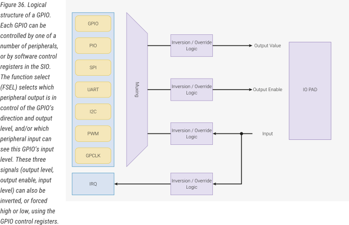
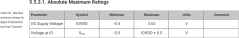
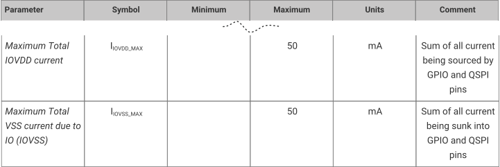
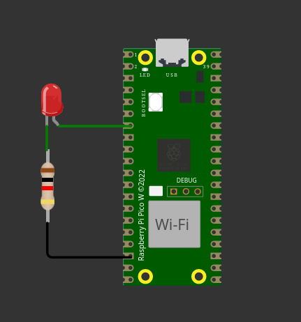
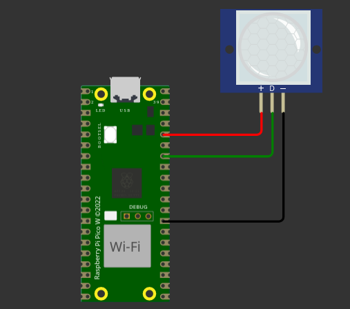
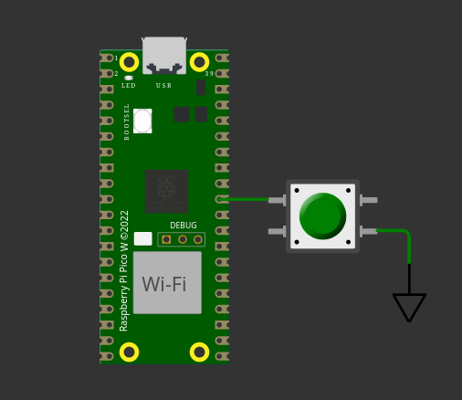

#  GPIO 

Material de apoio: 
[sdk](https://www.raspberrypi.com/documentation/pico-sdk/hardware.html#hardware_gpio){.ah-button}
/
[datasheet]( https://datasheets.raspberrypi.com/rp2040/rp2040-datasheet.pdf#section_gpio){.ah-button}


Utilizaremos o GPIO (General Purpose Input/Output) sempre que desejarmos controlar ou ler o estado de um pino digital por meio de código. Acionar um LED, ler o estado de um botão, controlar um motor de passo, ler um sensor de presença — todas essas ações podem ser realizadas através do uso deste periférico.

Um sinal digital é aquele que pode ser interpretado como binário: um ou zero, tem ou não tem, aceso ou apagado, etc. Em sistemas digitais, isso significa se o sinal possui ou não energia (aproximadamente 3V ou 0V).

Um microcontrolador pode precisar gerar um sinal digital em um de seus pinos (saída) ou ler um sinal digital que foi gerado externamente (entrada). Os microcontroladores modernos permitem configurar qualquer pino como entrada ou saída durante a execução do código.

É importante saber de antemão que, para controlar um LED, devemos configurar o pino como saída, ou para ler um botão, configurá-lo como entrada.

Segue uma pequena lista de atuadores/sensores que podem ser controlados digitalmente:

- `atuadores`: LED, motores, relés, etc.
- `sensores`: Botões, sensor de movimento, etc.

::: info
Usaremos o termo **atuadores** para tudo que o microcontrolador acionar/controlar e **sensores** para tudo que gerar informações para o microcontrolador (uC).
:::

## Periférico

O periférico é responsável por controlar digitalmente um pino da rp2040 e interligar os pinos aos periféricos internos do microcontrolador. Os pinos da rp2040 são divididos em dois bancos, porem um dos bancos é dedicado a leitura do programa de uma memória FLASH (`QSPI` bank), sobrando apenas o banco `GPI0` para o desenvolvedor. Este banco possui 30 pinos (`GPIO0` .. `GPIO29`) que podem ser usados tanto como entrada quanto como saída.

O GPIO opera como um mux, permitindo que outros periféricos internos do microcontrolador também acessem os pinos, como ilustrado na figura abaixo extraído do manual:



::: warning
Conforme manual respeite a tensão máxima de `3.3V` no pino da rp2040:



E a corrente máxima nos pinos (entrada ou saída) em `50mA`:


:::

### Na prática?

Na rasp pico todos os pinos são nomeados com um nome: [`GP0`, `GP1`]()[^1], ..., e no software iremos utilizar apenas o número: `0`, `1` para nos referenciarmos ao pino específico, para organizarmos melhor o software, iremos declarar uma variável global que define o número do pino:


```c
const int PIN = 5; // 5 varia de acordo com montagem do HW!
```

Agora é necessário ativar o pino, isso é feito usando:

```c
gpio_init(LED_PIN);
```

E então configurar se o pino vai ser saída ou entrada usando `GPIO_OUT` OU `GPIO_IN` na funcão `gpio_set_dir`:

```c
gpio_set_dir(PIN, GPIO_OUT); // Saída
gpio_set_dir(PIN, GPIO_IN ); // ou Entrada
```

Se o pino for saida podemos controlar usando:

``` c
gpio_put(PIN, 1); // para ativar
gpio_put(PIN, 0); // para desativar
```

Ou se for entrada, podemos ler o valor do pino:

```c
int status = gpio_get(PIN);
```

## Snippets

Snippets relacionados ao uso básico do periférico GPIO.

### GPIO Saída - LED

Configurando um pino como saída e piscando um LED.

[Simulação no wokwi](https://wokwi.com/projects/382410862049780737)
/
[pico-examples/blink/blink.c](https://github.com/raspberrypi/pico-examples/blob/master/blink)


::: half
```c
#include <stdio.h>
#include "pico/stdlib.h"
#include "hardware/gpio.h"

const int LED_PIN = 5;

int main() {
    stdio_init_all();

    gpio_init(LED_PIN);
    gpio_set_dir(LED_PIN, GPIO_OUT);

    while (true) {
        gpio_put(LED_PIN, 1);
        sleep_ms(250);
        gpio_put(LED_PIN, 0);
        sleep_ms(250);
    }
}
```
:::

::: half

:::


### GPIO Entrada - PIR (sem pull-up)

Exemplo de ler um sensor de presença.

[Simulação no wokwi](https://wokwi.com/projects/388537668851417089)

::: half
```c
#include <stdio.h>
#include "pico/stdlib.h"
#include "hardware/gpio.h"

const int PIR_PIN = 3; 

int main() {
    stdio_init_all();

    gpio_init(PIR_PIN);
    gpio_set_dir(PIR_PIN, GPIO_IN);
    //gpio_pull_up(PIR_PIN);

    while (true) {
        if (gpio_get(PIR_PIN))
            printf("Presenca detectada \n");
    }
}
```
:::

::: half

:::

    
### GPIO Entrada - Botão (com pull-up)

Exemplo de ler um botão com pull-up do próprio GPIO.

[Simulação no wokwi](https://wokwi.com/projects/382393931447496705){.ah-button}

Ao conectarmos um botão não placa é necessário ativarmos um pull-up interno do microcontrolador:

::: half

 ```c
#include <stdio.h>
#include "pico/stdlib.h"
#include "hardware/gpio.h"

const int BTN_PIN = 26; 

int main() {
    stdio_init_all();

    gpio_init(BTN_PIN);
    gpio_set_dir(BTN_PIN, GPIO_IN);
    gpio_pull_up(BTN_PIN);  // [!code focus]

    while (true) {
        if (!gpio_get(BTN_PIN))
            printf("Botão aperdado! \n");
    }
}
```
:::

::: half

:::


