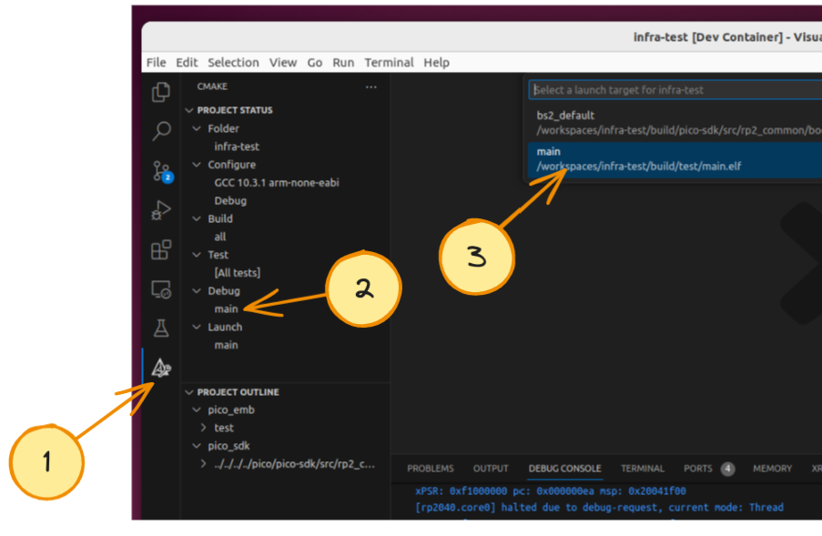
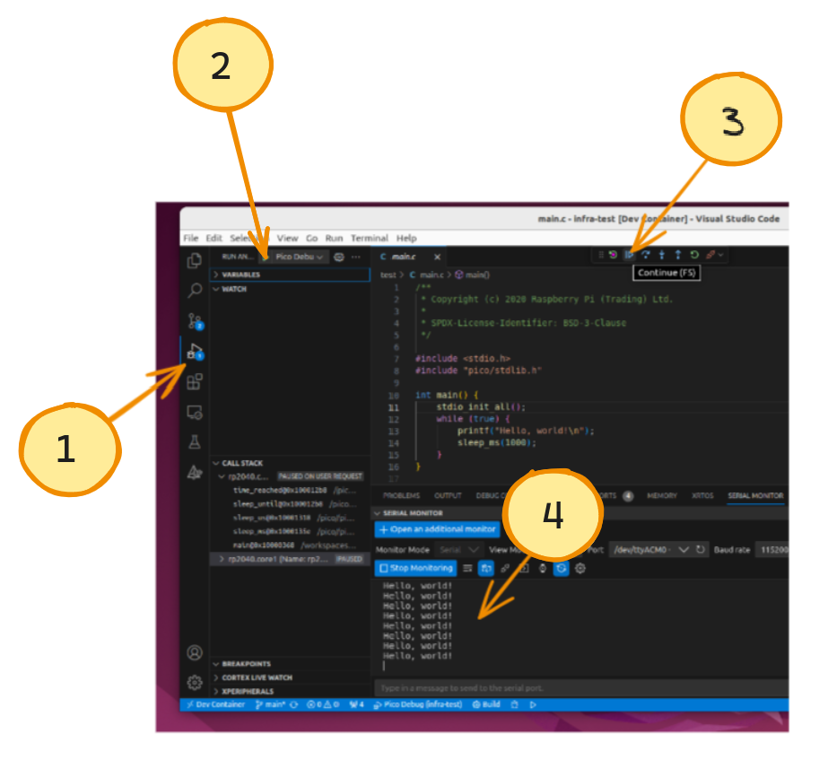
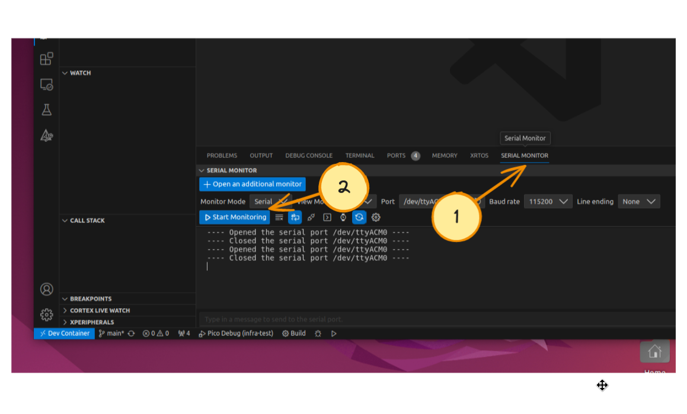

# Programando

::: info 
Os passos a seguir só são possíveis pois estamos fornecendo um projeto no vscode já pré-configurado. 
:::

No curso iremos usar o [debug-probe](https://www.raspberrypi.com/documentation/microcontrollers/debug-probe.html), um dispositivo criado para podermos gravar, depurar e ter acesso à saída UART da Raspberry Pi Pico.

Primeiro, faça a conexão como indicado a seguir:

::: info
    Note a necessidade de dois cabos USB!
:::

:::tabs
== tab Montagem

== tab Imagem

:::

Selecione o programa que iremos depurar:

Inicialize o software:

Abra o serial monitor (terminal):

