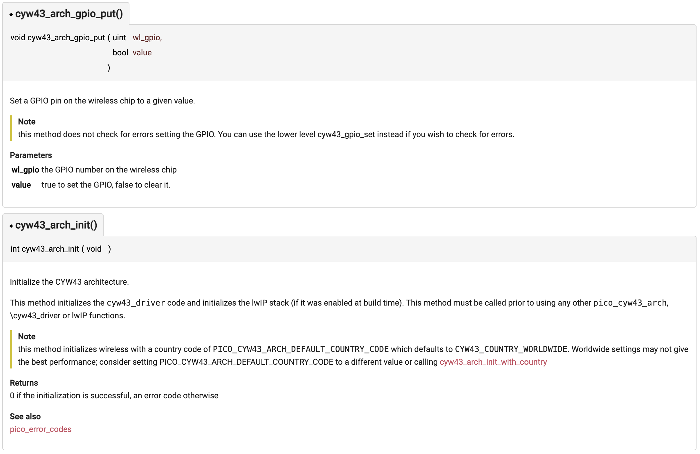
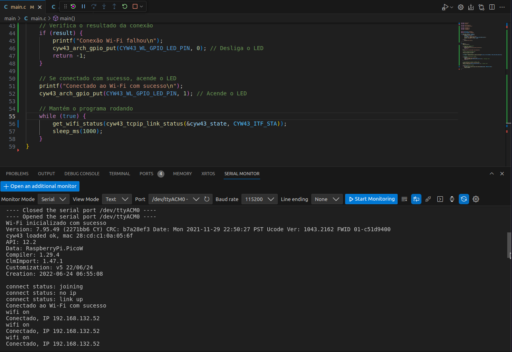

# Pico - W

O `Raspberry Pi Pico` e o `Pico W` são bem semelhantes. Para a grande maioria dos projetos não haverá diferença, tanto que até o momento não havíamos falado da existência dessa versão Pico W. O `Raspberry Pi Pico W` é uma versão do Pico que inclui conectividade wireless de 2.4GHz, isso abre oportunidades para uma variedade maior de aplicações.


::: tip
Datasheet Pico W: 

- [https://datasheets.raspberrypi.com/picow/pico-w-datasheet.pdf](https://datasheets.raspberrypi.com/picow/pico-w-datasheet.pdf)
:::

## Chip CYW43439

Ambas as versões, Pico e Pico W, utilizam o mesmo microcontrolador RP2040. A principal diferença está na inclusão do chip CYW43439 da Infineon no Pico W, que adiciona as seguintes funcionalidades wireless:

- WiFi 4 (802.11n), Single-band (2.4 GHz)
- WPA3
- SoftAP (Até 4 clientes)
- Bluetooth 5.2
    - Suporte para Bluetooth LE Central and Peripheral roles
    - Suporte para Bluetooth Classic

Na Pico W, alguns pinos internos (usuário não tem acesso) são direcionados para comunicação com o CYW43439 e foram substituídos pelo GPIO presente no CY43439. Esses podem ser controlados pelo usuário, são eles:

- `WL_GPIO2` – (Entrada) Sentido VBUS. ALTO quando VBUS está presente (Veja o datasheet)
- `WL_GPIO1` – (Saída) Controla o pino SMPS Power Save integrado (Veja o datasheet)
- `WL_GPIO0` – (Saída) Controla o LED On-board

::: warning
O led on-board é controlado pelo GPIO25 no Pico padrão. No Pico W, este GPIO é usado para comunicação com o módulo wireless, mas o controle do LED pode ser feito pelo pino `WL_GPIO0` do módulo wireless.
:::

## WIFI

Vamos utilizar a interface do CYW43439 para fazer um pisca led. O intuito é entender as configurações básicas para desenvolvimento de aplicações utilizando a versão Pico W.  

::: info
Consulte a página do site da disciplina [Pico W/pico-examples](/consulta/pico-examples) para saber como usar o repositório de exemplos da pico!
:::

### SDK

Para desenvolver aplicações utilizando o Pico W, vamos utilizar o projeto `infra-test`, mas você pode basear-se em qualquer projeto desenvolvido para o Pico até o momento e fazer as modificações: 

-  O arquivo `CMakeLists.txt` que está na raiz do projeto (onde fica a pasta build). Defina `PICO_BOARD` como `pico_w`:

```diff
set(PICO_BOARD pico_w)
```

- Já no arquivo `CMakeLists.txt` dentro da pasta do projeto (onde está o arquivo `main.c`) e adicione `pico_cyw43_arch_none` no `target_link_libraries`:

```diff
target_link_libraries(
                      ....
                      .....
                    pico_cyw43_arch_none)
```

No arquivo `main.c` adicione no headfile:

```c
#include "pico/cyw43_arch.h"
```

### Hello World

Um exemplo completo de um blink led:

[pico-examples/blob/master/pico_w/wifi/blink/picow_blink.c](https://github.com/raspberrypi/pico-examples/blob/master/pico_w/wifi/blink/picow_blink.c){.ah-button}

```c
#include <stdio.h>
#include "pico/stdlib.h"
#include "pico/cyw43_arch.h" // específica do Pico W, interface wireless

int main() {
    stdio_init_all();

    //inicializa o módulo wireless CYW43439. 
    //Se a inicialização falhar, a função retorna um valor não zero, e o programa imprime uma mensagem de erro e termina.
    if (cyw43_arch_init()) {
        printf("Wi-Fi init failed");
        return -1;
    }
    while (true) {
        cyw43_arch_gpio_put(CYW43_WL_GPIO_LED_PIN, 1);
        sleep_ms(250);
        cyw43_arch_gpio_put(CYW43_WL_GPIO_LED_PIN, 0);
        sleep_ms(250);
    }
}
```

- A função `cyw43_arch_gpio_put()` é chamada para definir o estado do LED (ligado ou desligado). 
- É definido neste arquivo: [https://github.com/raspberrypi/pico-sdk/blob/master/src/rp2_common/pico_cyw43_arch/cyw43_arch.c](https://github.com/raspberrypi/pico-sdk/blob/master/src/rp2_common/pico_cyw43_arch/cyw43_arch.c)
- O LED é controlado diretamente através do pino `CYW43_WL_GPIO_LED_PIN`. É definido neste arquivo: [https://github.com/raspberrypi/pico-sdk/blob/master/src/boards/include/boards/pico_w.h](https://github.com/raspberrypi/pico-sdk/blob/master/src/boards/include/boards/pico_w.h)

::: tip
Acesse a documentação SDK Oficial para ter mais detalhes: 
    [https://lorenz-ruprecht.at/docu/pico-sdk/1.4.0/html/index.html](https://lorenz-ruprecht.at/docu/pico-sdk/1.4.0/html/group__pico__cyw43__arch.html#ga7a05bd21f02a0effadbba1e8266b8771)


:::

### Wifi e Bluetooth

- Para exemplos de utilização do WiFi e Bluetooth, recomenda-se consultar documentações específicas e tutoriais que exploram essas funcionalidades em projetos práticos.

[pico-examples/blob/master/pico_w/](https://github.com/raspberrypi/pico-examples/blob/master/pico_w/)

## Snippets

Snippets de código para o WIFI.

### Scan Wi-fi

Vamos implementar uma scan para listar as redes wifi disponíveis para se conectar. O código é adaptado do repositório oficial da raspiberry pi pico W.

- [https://github.com/raspberrypi/pico-examples/blob/master/pico_w/wifi/wifi_scan/picow_wifi_scan.c](https://github.com/raspberrypi/pico-examples/blob/master/pico_w/wifi/wifi_scan/picow_wifi_scan.c)

```C
#include <stdio.h>
#include "pico/stdlib.h"
#include "pico/cyw43_arch.h"

// Função de callback para resultados de escaneamento de Wi-Fi
static int scan_result(void *env, const cyw43_ev_scan_result_t *result) {
    if (result) {
        // Exibe informações sobre a rede Wi-Fi encontrada
        printf("SSID: %-32s RSSI: %4d Canal: %3d MAC: %02x:%02x:%02x:%02x:%02x:%02x Segurança: %u\n",
            result->ssid, result->rssi, result->channel,
            result->bssid[0], result->bssid[1], result->bssid[2], 
            result->bssid[3], result->bssid[4], result->bssid[5],
            result->auth_mode);
    }
    return 0;
}

int main() {
    stdio_init_all(); // Inicializa todas as interfaces padrão de I/O

    // Inicializa o módulo Wi-Fi
    if (cyw43_arch_init()) {
        printf("Falha ao inicializar\n");
        return 1;
    }

    // Habilita o modo estação (STA)
    cyw43_arch_enable_sta_mode();

    // Variáveis para controle de tempo e status de escaneamento
    absolute_time_t scan_test = nil_time;
    bool scan_in_progress = false;

    while (true) {
        if (absolute_time_diff_us(get_absolute_time(), scan_test) < 0) {
            if (!scan_in_progress) {
                // Configura e inicia um escaneamento de Wi-Fi
                cyw43_wifi_scan_options_t scan_options = {0};
                int err = cyw43_wifi_scan(&cyw43_state, &scan_options, NULL, scan_result);
                if (err == 0) {
                    printf("\nRealizando escaneamento de Wi-Fi\n");
                    scan_in_progress = true;
                } else {
                    printf("Falha ao iniciar escaneamento: %d\n", err);
                    scan_test = make_timeout_time_ms(10000); // Aguarda 10s e tenta novamente
                }
            } else if (!cyw43_wifi_scan_active(&cyw43_state)) {
                scan_in_progress = false;
                scan_test = make_timeout_time_ms(10000); // Aguarda 10s e tenta novamente
            }
        }
    }

    cyw43_arch_deinit(); // Desliga o módulo Wi-Fi antes de encerrar
    return 0;
}
```

- `cyw43_arch_enable_sta_mode()`: O dispositivo atua como um cliente Wi-Fi.

- `cyw43_wifi_scan_options_t()`: De acordo com a documentação oficial, atualmente as opções desse argumento são ignoradas. 

- `cyw43_wifi_scan()`: Este método inicia o processo de escaneamento por redes Wi-Fi disponíveis. Ele utiliza as configurações de escaneamento e requer uma função de callback (quarto parametro) para lidar com os resultados encontrados durante o escaneamento.

- `cyw43_wifi_scan_active()`: Verifica se um escaneamento de redes Wi-Fi está ativo no momento. Retorna `true` se um escaneamento estiver em andamento e `false` caso contrário, ajudando a gerenciar o fluxo de controle em aplicações que dependem do status do escaneamento.

- `scan_result`: A função de callback pega o resultado e imprime seu conteúdo. O `BSSID` (Basic Service Set Identifier) da rede, que é o endereço MAC do ponto de acesso que transmite a SSID. É composto por 6 bytes, usualmente exibidos em formato hexadecimal.

### Conectando-se na internet

::: warning
Eu gastei um tempinho até fazer os ajustes do cmake para compilar corretamente o exemplo de conexão wifi adaptado a seguir. Além da configuração normal para usar a pico_w, realizei as seguintes configurações:

- No `cmakelist.txt` da pasta `main`: adicione `target_include_directories(main PRIVATE ${CMAKE_CURRENT_LIST_DIR} )`. 
- O suporte ao Wi-Fi na Pico W requer o uso das bibliotecas específicas fornecidas no SDK, por isso altere `pico_cyw43_arch_none` para `pico_cyw43_arch_lwip_threadsafe_background`.
  
Estou assumindo que você está compilando a pasta de projeto main, caso contrario substitua pelo nome da pasta do seu projeto.

- Na pasta de projeto main: criei uma cópida do arquivo `lwipopts_examples_common.h` do [repositório de exemplos da pico](https://github.com/raspberrypi/pico-examples/blob/master/pico_w/wifi/lwipopts_examples_common.h) para a pasta main com o nome `lwipopts.h`.  
:::

O código base a seguir irá **tentar** se conectar à internet, se for sucesso o led da placa acende.

```C
#include <stdio.h>
#include "pico/stdlib.h"
#include "pico/cyw43_arch.h"

#define WIFI_SSID "your_wifi_ssid"
#define WIFI_PASSWORD "your_wifi_password"

int main() {
    stdio_init_all();

    // Inicializa o módulo Wi-Fi
    if (cyw43_arch_init()) {
        printf("Falha na inicialização do Wi-Fi\n");
        return -1;
    }
    printf("Wi-Fi inicializado com sucesso\n");

    // Ativa o modo de estação (STA)
    cyw43_arch_enable_sta_mode();

    // Tenta conectar ao Wi-Fi
    int result = cyw43_arch_wifi_connect_blocking(WIFI_SSID, WIFI_PASSWORD, CYW43_AUTH_WPA2_MIXED_PSK);

    // Verifica o resultado da conexão
    if (result) {
        printf("Conexão Wi-Fi falhou\n");
        cyw43_arch_gpio_put(CYW43_WL_GPIO_LED_PIN, 0); // Desliga o LED
        return -1;
    }

    // Se conectado com sucesso, acende o LED
    printf("Conectado ao Wi-Fi com sucesso\n");
    cyw43_arch_gpio_put(CYW43_WL_GPIO_LED_PIN, 1); // Acende o LED

    // Mantém o programa rodando
    while (true) {
        printf("loop principal\n");
        sleep_ms(1000);
    }
}
```

- `cyw43_arch_enable_sta_mode()`: O dispositivo atua como um cliente Wi-Fi, o que significa que ele se conecta a uma rede Wi-Fi existente (como a de sua casa ou escritório).

- `cyw43_arch_wifi_connect_blocking()`: Esta função tenta estabelecer uma conexão Wi-Fi usando as credenciais fornecidas (SSID e senha) e tipo de autenticação. Ela bloqueará a execução do programa até que a conexão Wi-Fi seja estabelecida ou falhe. Isso significa que, se a conexão Wi-Fi demorar muito ou não for bem-sucedida, seu programa esperará indefinidamente, a menos que seja interrompido externamente.

::: highlight
De acordo com a documentação oficial, existem 4 tipos de autenticação: `CYW43_AUTH_OPEN`, `CYW43_AUTH_WPA_TKIP_PSK`, `CYW43_AUTH_WPA2_AES_PSK`, `CYW43_AUTH_WPA2_MIXED_PSK`.  
:::

Podemos realizar a conexão Wi-Fi da pico W tanto com função `cyw43_arch_wifi_connect_blocking()` como com a função `cyw43_arch_wifi_connect_timeout_ms()`, mas cada uma comporta-se de uma forma diferente.

- `cyw43_arch_wifi_connect_timeout_ms()`: Esta função tenta estabelecer uma conexão Wi-Fi com um parâmetro adicional de `time out` (tempo limite) em milissegundos. Se a conexão não for bem-sucedida dentro do período especificado, ela retorna um erro. A duração do tempo limite permite especificar por quanto tempo o sistema deve tentar se conectar antes de desistir.

::: tip
A escolha entre as funções para tentar estabelecer uma conexão Wi-Fi, depende dos requisitos de responsividade da sua aplicação e de como você deseja lidar com cenários em que a conectividade Wi-Fi está atrasada ou indisponível. Para aplicações onde você não pode se dar ao luxo de esperar indefinidamente, `cyw43_arch_wifi_connect_timeout_ms()` fornece uma maneira de falhar de forma controlada após um período definido. Por outro lado, `cyw43_arch_wifi_connect_blocking()` é mais simples de usar quando o tempo para estabelecimento da conexão Wi-Fi não é crítico para a continuação do programa.
:::

O drive cyw43 possui a função `cyw43_tcpip_link_status` que retorna o status da conexão. As opções são:

| link status         | Meaning                                                 |
|---------------------|---------------------------------------------------------|
| `CYW43_LINK_DOWN  ` | Wifi down                                               |
| `CYW43_LINK_JOIN  ` | Connected to wifi                                       |
| `CYW43_LINK_NOIP  ` | Connected to wifi, but no IP address                    |
| `CYW43_LINK_UP    ` | Connect to wifi with an IP address                      |
| `CYW43_LINK_FAIL  ` | Connection failed                                       |
| `CYW43_LINK_NONET ` | No matching SSID found (could be out of range, or down) |
| `CYW43_LINK_BADAUT` | Authenticatation failure                                |


Vamos criar uma função `get_wifi_status` que recebe o retorno dessa opção, Vamos utilizar para garantir a conexão de rede.

```C
void get_wifi_status(int status) {
    if (status == CYW43_LINK_UP) {
        printf("wifi on\n");
        
    } else {
        printf("wifi off\n");
    }
}
```

Para chamar a função:

```C
get_wifi_status(cyw43_tcpip_link_status(&cyw43_state, CYW43_ITF_STA));

```

### Verificando seu IP

Após conectado é possível verificar o IP alocado para a raspberry pi Pico. Adicionando o techo de código a seguir na função `get_wifi_status`.

```C
   char sIP[] = "xxx.xxx.xxx.xxx";  
    strcpy (sIP, ip4addr_ntoa(netif_ip4_addr(netif_list)));  
    printf ("Conectado, IP %s\n", sIP);  
```



## Próximmos passos

Agora você já está pronto para desbravar o mundo do WIFI explorando novas possibilidades.

Sugestão:

- Explore os exemplos de wifi do [repositório de exemplos da pico](/consulta/pico-examples)
