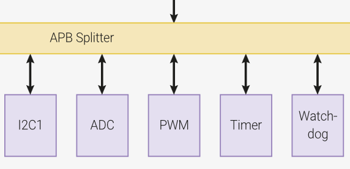

# PWM

Pulse Width Modulation (PWM) é uma forma de onda digital periódica que permite modular o tempo em que o sinal permanece em nível alto.


`Duty Cycle` é o termo utilizado para indicar quanto tempo o sinal do PWM permanece em nível alto. Um `Duty Cycle` de 40% indica que o sinal fica por `40%` do tempo em nível alto e `60%` em nível baixo.

Um aspecto muito importante no PWM, e que é pouco abordado, é a frequência na qual o sinal será gerado. Se a frequência for muito baixa, o sistema que estamos controlando pode não se comportar como esperado. Por exemplo, um motor pode vibrar se a frequência do PWM for muito baixa. É importante não confundir frequência com o `Duty Cycle`, são conceitos independentes!

Com essa modulação, conseguimos controlar uma série de sistemas:

- Motor DC: É uma forma fácil de controlarmos a tensão média no motor, controlando, por sua vez, a sua velocidade.
- LED: Conseguimos controlar a intensidade do LED.
- Forno: Com o PWM, conseguimos controlar a temperatura de um forno elétrico.

Somos capazes de gerar um sinal PWM via software, mas isso não é muito eficiente:

```c
// PWM de 33% de duty cycle via software
while(1) {
    gpio_put(PWM_PIN, 1);
    sleep_ms(2);
    gpio_put(PWM_PIN, 0);
    sleep_ms(4);
}
```

O nosso microcontrolador possui um periférico dedicado a gerar sinais de PWM:



Do manual do RP2040, podemos extrair a informação de que o periférico é capaz de gerar 16 sinais independentes de PWM em qualquer um dos pinos do GPIO:

> The RP2040 PWM block has 8 identical slices. Each slice can drive two PWM output signals, or measure the frequency
> or duty cycle of an input signal. This gives a total of up to 16 controllable PWM outputs. All 30 GPIO pins can be driven
> by the PWM block.

## SDK

Para usar o PWM você deve modificar o `CMakeLists.txt` adicionando `hardware_pwm` no `target_link_libraries`:

```diff
target_link_libraries(
                      ....
                      .....
+                     hardware_pwm)
```

E adicionar no headfile:

```c
#include "hardware/pwm.h"
```

## Snippets

Códigos exemplo para o PWM.

### Hello PWM

O exemplo a seguir configura o pino `GP28` para operar com um PWM de 1Mhz com 100 possíveis níveis de Duty Cycle e configura o pino para operar com um `Duty Cycle` de 40%.

[Simulação no wokwi](https://wokwi.com/projects/392432331889921025){.ah-button}
/
[pico-examples/pwm/hello_pwm](https://github.com/raspberrypi/pico-examples/blob/master/pwm/hello_pwm/hello_pwm.c){.ah-button}

```c
/**
 * Copyright (c) 2020 Raspberry Pi (Trading) Ltd.
 *
 * SPDX-License-Identifier: BSD-3-Clause
 */

// Output PWM signals on pins 0 and 1

#include "pico/stdlib.h"
#include "hardware/pwm.h"

const int PWM_0_PIN = 28;

int main() {
    // Tell GPIO they are allocated to the PWM
    gpio_set_function(PWM_0_PIN, GPIO_FUNC_PWM);

    // Find out which PWM slice is connected to GPIO
    uint slice_num = pwm_gpio_to_slice_num(PWM_0_PIN);

    // pwm freq
    pwm_set_clkdiv(slice_num, 125); // pwm clock should now be running at 1MHz

    // Set period of 100 cycles (0 to 99 inclusive)
    pwm_set_wrap(slice_num, 100);

    // Set channel A output high for one cycle before dropping
    // PWM set to 30%
    pwm_set_chan_level(slice_num, PWM_CHAN_A, 70);

    // Set the PWM running
    pwm_set_enabled(slice_num, true);

    while(1){


    }
}
```

### Múltiplos PWMs

Criamos uma função que auxiliar no uso de múltiplos PWMs, o problema é saber qual CHANNEL cada PWM vai ser alocado, a função a seguir retorna o `slice` e o `channel` relativo ao PWM do pino. o `init_pwm` possui como argumento:

- `pwm_pin_gp`: O GPIO que deseja configurar o PWM
- `resolution`: A resolucão do pwm: `100`: vai de `0` a `99`, `256`: vai de `0` a `255`
- `slice_num`: Retorna o slice alocao para o pino
- `chan_num`: Retorna o channel alocao para o pino

A demo a seguir faz um `fade` nos pinos GP27 e GP15.

```c

#define PWM_GP27
#define PWM_GP15

void init_pwm(int pwm_pin_gp, uint resolution, uint *slice_num, uint *chan_num) {
    gpio_set_function(pwm_pin_gp, GPIO_FUNC_PWM);
    uint slice = pwm_gpio_to_slice_num(pwm_pin_gp);
    uint chan = pwm_gpio_to_channel(pwm_pin_gp);
    pwm_set_clkdiv(slice, 125); // pwm clock should now be running at 1MHz
    pwm_set_wrap(slice, resolution);
    pwm_set_chan_level(slice, PWM_CHAN_A, 0);
    pwm_set_enabled(slice, true);

    *slice_num = slice;
    *chan_num = chan;
}


void main() {
    int pwm_0_slice, pwm_1_chan;
    int pwm_1_slice, pwm_1_chan;
    init_pwm(PWM_GP27, 256, &pwm_0_slice, &pwm_0_chan);
    init_pwm(PWM_GP15, 256, &pwm_1_slice, &pwm_1_chan);

    while(1) {
            for (int i=0; i < 256; i++){
                pwm_set_chan_level(pwm_0_slice, pwm_0_chan, i);
                pwm_set_chan_level(pwm_1_slice, pwm_1_chan, 256 - i);
                sleep_ms(10);
            }
    }
}
```
