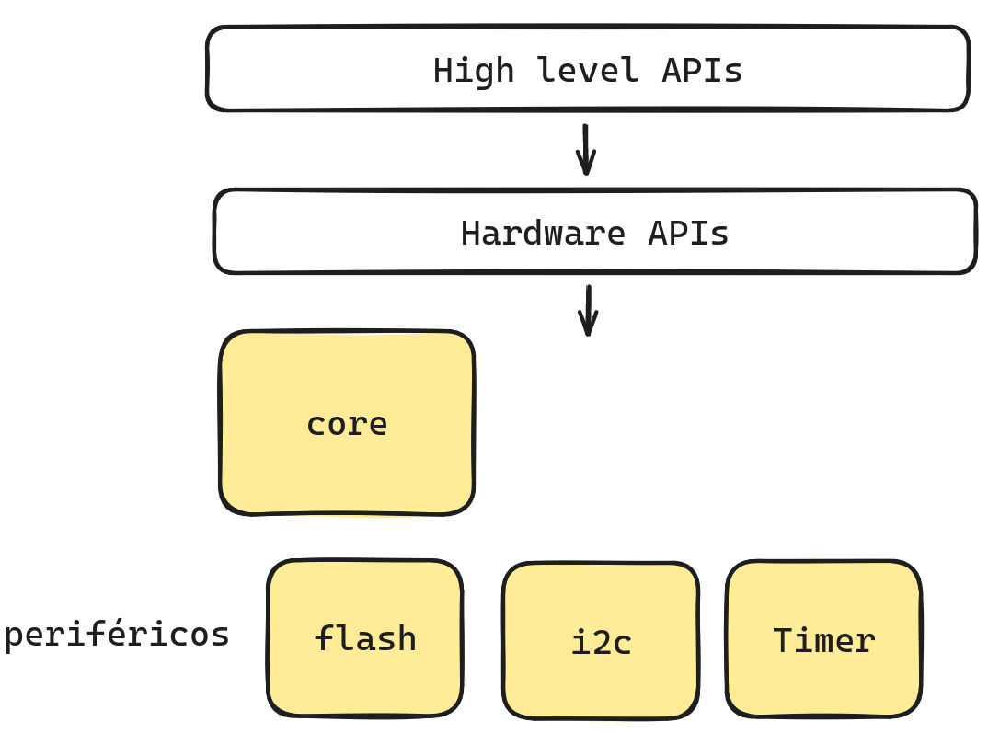

# Timer

O timer é um periférico responsável por contar tempo, normalmente utiliza o clock do próprio micro-controladador para isso. O timer da pico possui os seguintes usos:

- System timer: Usado para gerar uma base de tempo para outros periféricos.
- Counter: Possibilita a leitura de quanto tempo já se passou (64 bits -> tempo máximo de `846957946` anos!)
- Alarm: Possibilita contarmos tempo dado uma base (32bits -> tempo máximo `72` minutos).

A base de tempo da rp2040 é de `1us`  e o temporizador possui 4 alarmes e emite uma interrupção separada para cada alarme. Os alarmes correspondem aos 32 bits inferiores do contador de 64 bits, o que significa que eles podem ser disparados no máximo a 2^32 microssegundos no futuro. Isso é equivalente ao período máximo de `~72 minutes`.

## High Level APIs



Iremos acessar o timer usando a biblioteca de alto nível da rp2040, existe uma forma de configurar o timer diretamente acessando o periférico, mas ai a fica a cargo do desenvolvedor lidar com uma série de detalhes. Este conjunto de APIs está disponível no `sdk` da pico, não precisamos fazer nada para usarmos.

## Snippets

Snippets relacionados ao uso do timer via iso das funções diponíveis no *high level api*.

### Tempo absoluto

É possível termos uma base de tempo que é fornecida pelo periférico do Timer, a contagem deste tempo é independente do que está acontecendo com o programa ou com o CORE.

**Código:**

```c{7,8}
#include <stdio.h>
#include "pico/stdlib.h"

int main() {
    stdio_init_all();
    while(1){
        uint32_t start_ms = to_ms_since_boot(get_absolute_time());
        uint64_t start_us = to_us_since_boot(get_absolute_time());
        sleep_ms(100);
    }
}
```

Este trecho mostra como utilizar as funções `to_ms_since_boot` e `to_us_since_boot` para obter o tempo em milissegundos e microssegundos desde a inicialização do sistema, respectivamente. Utiliza-se `get_absolute_time()` para obter o tempo atual. Isso pode ser útil para temporizações precisas e medições de intervalos de tempo no desenvolvimento de aplicações com o Raspberry Pi Pico.

### Timer repetitivo

Cria um timer que chama uma função de callback a cada `x` Hz. Se a função de `callback` retornar `true` o timer continua repetindo, caso contrário interrompe e não acontece mais.

::: warning
Diferente do GPIO, aqui devemos configurar uma função de `callback` para cada timer gerado!
:::


[Simulação no wokwi](https://wokwi.com/projects/390749972753978369){.ah-button} / [pico-examples/timer/hello_timer](https://github.com/raspberrypi/pico-examples/blob/master/timer/hello_timer/hello_timer.c){.ah-button}

```c
#include <stdio.h>
#include "pico/stdlib.h"

volatile int g_timer_0 = 0;

bool timer_0_callback(repeating_timer_t *rt) {
    g_timer_0 = 1;
    return true; // keep repeating
}

int main() {
    stdio_init_all();

    int timer_0_hz = 5;
    repeating_timer_t timer_0;

    if (!add_repeating_timer_us(1000000 / timer_0_hz, 
                                timer_0_callback,
                                NULL, 
                                &timer_0)) {
        printf("Failed to add timer\n");
    }

    while(1){
        if(g_timer_0){
            printf("Hello timer 0 \n");
            g_timer_0 = 0;
        }
    }
}
```

::: tip Dicas
Você pode usar:

- `add_repeating_timer_ms` ou `add_repeating_timer_us`. 

Você pode criar mais de um timer, seguindo a mesma estrutura. Lembre de que para cada timer você precisa declarar um novo `repearing_timer` e uma nova função de `callback`.

Se a função de `callback` retornar `true`, o timer executa mais uma vez, `false` para de executar.

Para cancelar o timer a qualquer momento, use: `cancel_repeating_timer(&timer);`

Tempo negativo ou positivo:

- Se o atraso for `> 0`, então este é o atraso entre o término do callback anterior e o início do próximo.
- Se o atraso for ==negativo==, então a próxima chamada ao callback será exatamente 500ms após o início da chamada ao último callback.
:::

### Alarm

O alarm é uma maneira de conseguirmos usar o periférico do timer para gerar um evento não periódico, o alarme é disparado uma única vez.

::: warning
Diferente do GPIO, aqui devemos configurar uma função de `callback` para cada timer gerado! 
:::

```c
#include <stdio.h>
#include "pico/stdlib.h"

volatile bool timer_fired = false;

int64_t alarm_callback(alarm_id_t id, void *user_data) {
    timer_fired = true;

    // Can return a value here in us to fire in the future
    return 0;
}

int main() {
    stdio_init_all();

    // Call alarm_callback in 300 ms
    // usar esse alarm para cancelar 
    alarm_id_t alarm = add_alarm_in_ms(300, alarm_callback, NULL, false))

    if (!alarm) {
        printf("Failed to add timer\n");
    }

    while(1){
        if(timer_fired){
            timer_fired = 0;
            printf("Hello from alarm!");
        }
    }
}
```
    
::: tip Dicas
Você pode usar: 

- `add_alarm_in_us` ou `add_alarm_in_ms`.

Para cancelar um alarme use:

```c
cancel_alarm(alarm);
```
:::
