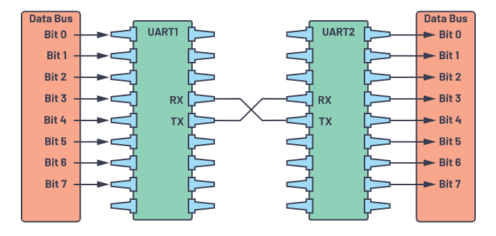
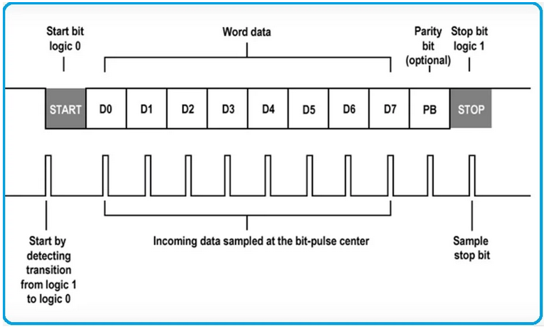
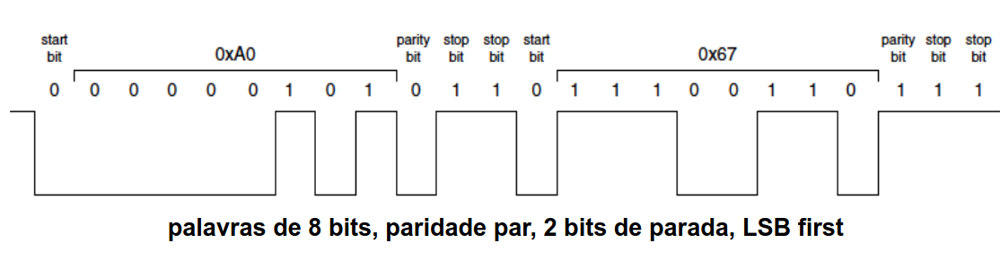
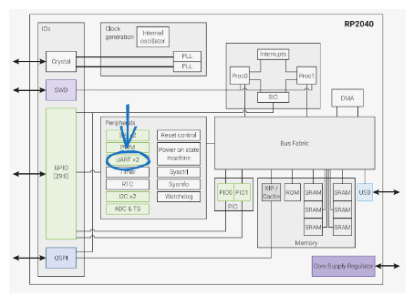
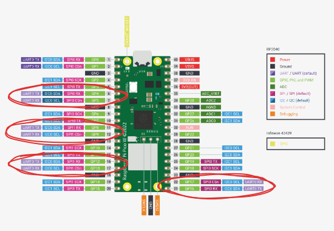

# UART

UART é um dos protocolos mais utilizados para comunicação em sistemas digitais, o que inclui computadores, microcontroladores e sistemas embarcados. **UART** significa **Universal Asynchronous Receiver-Transmitter**, e é um protocolo de comunicação utilizado em hardware que permite uma comunicação assíncrona - comunicação que não ocorre ao mesmo tempo entre os dispositivos - e com velocidade de transmissão configurável.

Aplicações práticas:

- Debugging: UART ajuda na capturação de mensagens do sistemas e consequentemente ajuda na solução de bugs do sistema.
- Teste: Verificação de produtos antes de saírem da linha de produção buscando uma melhor qualidade para o usuário final. 
- Podemos utilizar UART para conectar com módulos bluetooth e também com módulos de GPS.

Vantagens do UART:

- UART por si só é simples pois utiliza dois fios.
- Há verificação de bits de paridade para verificação de erro de pacotes de dados.
- UART é extremamente utilizado.

Desvantagens do UART:

- O data frame é limitado 8 bits.
- O Baud Rate do dispositivo que transmite e do que recebe devem ser o mesmo.

## Na prática

A principal utilização de um UART para transmissão e recebimento de dados está demonstrado na Figura 1, nela é possível ver duas UART diferentes, e entre elas há uma comunicação bidirecional, atraveś dos pinos RX e TX podemos transferir neste caso até 1 byte de informações. 

Figura 1 - Transmissão e recepção UART 



### Transmissão na prática

No contexto da UART, o pacote de dados transmitido segue a estrutura da Figura 2, nela é possível ver que temos o **Start Bit**, o **Data Frame ou Word data**, o **Parity Bits** e o **Stop Bits**. Falaremos um pouco sobre eles a seguir.

Figura 2 - Bits protocolo UART



- **Start Bit**: Quando **não** está transmitindo, o UART fica em nível lógico alto, e **quando transmite** o UART muda de nível lógico alto para nível lógico baixo. O UART que receberá os dados vai detectar a mudança de HIGH para LOW voltage de quem está transmitindo e começará a leitura dos bits precisamente de acordo com o baud rate. 

- **Paridade**: O Bit de Paridade serve para checar se algum bit foi alterado durante a transmissão. Os bits podem mudar por radiação elegromagnética, baud rates diferentes ponta-a-ponta, longa distâncias de transmissão, entre outros motivos. 
**Se o Bit de paridade for 0, o número de bits 1 no dataframe deve ser um valor par**. 
**Se o Bit de paridade for 1, o número de bits 1 no dataframe deve ser um valor ímpar**

- **Stop Bits**: Para notificar o fim do pacote, a UART envia no final os Stop Bits, que servem para identificar o final da transmissão, para tal o Stop Bit com 1 modifica o estado de transmissão de dados da UART e a mesma para a transmissão em seguida. O Stop Bits pode ter até dois bits de parada.

- **Data Frame**: Data Frame é o trecho que contém os dados a serem transmitidos, ele pode ter tamanho de até 8 bits. Na maioria dos casos os dados são enviado com o ***Least Significant Bit** primeiro.

### Exemplo de transmissão:

A figura a seguir demonstramos a transferência de 2 pacotes de dados:



- O primeiro pacote contendo **0xA0** hexadecimal, que é igual a **10100000** em binário e que em ASCII é o equivalente ao símbolo **á**.

- O segundo pacote contendo **0x67** hexadecimal, que é igual a **01100111** em binário e que em ASCII é o equivalente ao símbolo **g**.

Neste caso o **LSB** é utilizado, então o primeiro dado a ser enviado é o bit menos significativo, e o último é o **MSB**, o bit com maior valor significativo.
Checando os Bits do data frame e o bit da paridade, vemos que não obtivemos perca de pacotes nas transmissões.
Observamos também que o data frame começou a ser transmitido depois que o Start Bit mudou de 1 para 0.
E finalmente, quando tivemos o Stop Bit, neste caso dois, finalizamos a primeira transferência e iniciamos a outra.
Se tivermos no dispositivo receptor UART algo que convertesse os bits recebidos para caracteres, teríamos recebido os caracteres **á** e **g** em sequência.

## RP2350

No microcontrolador que estamos utilizando - o RP2040 -, conseguimos utilizar até duas instâncias do periférico UART. Na figura 4 é demonstrado o periférico UART da RP2040, onde há a localização do mesmo dentro do chip.



### Na Prática

Será abordado neste tópico algumas funções essenciais do nosso **SDK RP2040** para utilizarmos o **periférico UART**.

```c
    uart_init(art_inst_t * uart, uint baudrate)
```

- Inicializa a UART e seleciona por default:
    - 8 data bits (tamanho do data frame)
    - Sem paridade
    - 1 Stop Bit
- Possui dois argumentos:
    - uart: Para definir qual instância do UART será utilizada (temos disponíveis a **uart0** e a **uart1**)
    - baudrate: Baudrate (9600, 115200, etc)

```c
gpio_set_function(uint gpio, enum gpio_function fn)
```

- Serve como um MUX para selecionar qual das funções disponíveis do pino em questão será utilizada. Para escolhermos o pino certo temos sempre que conferir as funções de cada pino.
- Possui dois argumentos:
    - O número do GPIO
    - A função que você quer utilizar do pino

É possível ver na figura 5 quais pinos podem fornecer a função de UART, podemos utilizar apenas 2 interfaces, a UART0 e a UART1.



```c
    uart_putc_raw (uart_inst_t * uart, char c)
```

- Escreve apenas um caracter para ser transmitido via UART sem qualquer conversão.
- Possui dois argumentos:
    - O primeiro é a instância (uart0 ou uart1) no qual o caracter será transmitido.
    - O segundo é o caracter que será enviado.

```c
uart_puts (uart_inst_t * uart, const char * s)
```

- Transmite uma string via UART com conversão CR/LF.
- Possui dois argumentos:
    - O primeiro é a instância (uart0 ou uart1) no qual o caracter será transmitido.
    - O segundo argumento é a string a ser enviada.


```c
uart_putc (uart_inst_t * uart, char c)
```

- Transmite um caracter via UART com conversão CR/LF opcional.
- Possui dois argumentos:
    - O primeiro é a instância (uart0 ou uart1) no qual o caracter será transmitido.
    - O segundo é o caracter a ser enviado.
 
## SDK
Para usar o UART você deve modificar o `CMakeLists.txt` adicionando `hardware_uart` no `target_link_libraries`:

```diff
target_link_libraries(
                      ....
                      .....
+                     hardware_uart)
```

E adicionar no headfile:

```c
#include "hardware/uart.h"
```

## Snippets

Códigos de exemplo para o UART.

### Hello UART

[Simulação no wokwi](/definir/link){.ah-button}
/
[pico-examples/dma/hello_dma/hello_dma.c](https://github.com/raspberrypi/pico-examples/blob/master/uart/hello_uart/hello_uart.c){.ah-button}

```c
/**
 * Copyright (c) 2020 Raspberry Pi (Trading) Ltd.
 *
 * SPDX-License-Identifier: BSD-3-Clause
 */


#include <stdio.h>
#include "pico/stdlib.h"
#include "hardware/uart.h"

/// \tag::hello_uart[]

#define UART_ID uart0
#define BAUD_RATE 115200

// We are using pins 0 and 1, but see the GPIO function select table in the
// datasheet for information on which other pins can be used.
#define UART_TX_PIN 0
#define UART_RX_PIN 1

int main() {
    // Set up our UART with the required speed.
    uart_init(UART_ID, BAUD_RATE);

    // Set the TX and RX pins by using the function select on the GPIO
    // Set datasheet for more information on function select
    gpio_set_function(UART_TX_PIN, GPIO_FUNC_UART);
    gpio_set_function(UART_RX_PIN, GPIO_FUNC_UART);

    // Use some the various UART functions to send out data
    // In a default system, printf will also output via the default UART

    // Send out a character without any conversions
    uart_putc_raw(UART_ID, 'A');

    // Send out a character but do CR/LF conversions
    uart_putc(UART_ID, 'B');

    // Send out a string, with CR/LF conversions
    uart_puts(UART_ID, " Hello, UART!\n");
}

/// \end::hello_uart[]
```

## Referências:

- "UART COmmunication Working Applications". Disponível em: https://microcontrollerslab.com/uart-communication-working-applications/

- "UART a HARDWARE Communication Protocol". Disponível em : https://www.analog.com/en/resources/analog-dialogue/articles/uart-a-hardware-communication-protocol.html

- "RP2040 Datasheet." Disponível em: https://datasheets.raspberrypi.com/rp2040/rp2040-datasheet.pdf?_gl=1133hn0o_gaNzczNjI3NTcwLjE3MDA1OTg2MjI._ga_22FD70LWDS*MTcxMTQ3MzYxOC4yMi4xLjE3MTE0NzQyMDguMC4wLjA

- "Raspberry Pi Pico W Datasheet." Disponível em: https://datasheets.raspberrypi.com/picow/pico-w-datasheet.pdf?_gl=1cxqmyl_gaNzczNjI3NTcwLjE3MDA1OTg2MjI._ga_22FD70LWDS*MTcxMTQ3MzYxOC4yMi4xLjE3MTE0NzQzNzYuMC4wLjA

- "Raspberry Pi Pico C/C++ SDK." Disponível em: https://datasheets.raspberrypi.com/pico/raspberry-pi-pico-c-sdk.pdf?_gl=11jwcl4q_gaNzczNjI3NTcwLjE3MDA1OTg2MjI._ga_22FD70LWDS*MTcxMTQ3MzYxOC4yMi4xLjE3MTE0NzQzNzYuMC4wLjA

- "Comunicação Serial (UART)". Disponível em: http://www1.rc.unesp.br/igce/demac/alex/disciplinas/MicroII/EMA864315-Serial.pdf.
