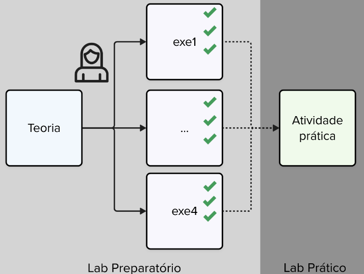
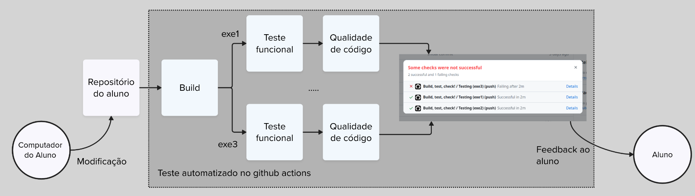

# Entregas

### Labs Core

A disciplina utilizará atividades preparatórias que ajudarão vocês no desenvolvimento dos laboratórios. Essas atividades devem ser realizadas no VSCode e não necessitam do uso da placa de desenvolvimento. O objetivo é desacoplar um pouco os elementos: com o simulador, é possível praticar apenas o código e alguns aspectos da conexão de hardware, sem a complexidade de montar os componentes eletrônicos.

Já as atividades de laboratório prático demandam que vocês utilizem a placa física e apliquem o que aprenderam no ambiente virtual em uma aplicação real.

### APS

Ao todo, são duas APS. Elas se diferenciam dos laboratórios por serem mais complexas, realizadas em duplas e por envolverem design e criação de protótipos. São elas:

1. Jogo Genius
2. Desenvolvimento de um controle Bluetooth para um jogo

::: highlight
Mais informações em breve...
:::
## Sistema de Verificação Automática

### Projeto

No curso, temos um único projeto, que é de escopo aberto. 

::: highlight
Mais informações em breve...
:::

## Sistema de Verificação Automática

A disciplina faz uso de um sistema de verificação automática integrado ao GitHub, que envolve diferentes frentes:

1. Verificação se o projeto compila
2. Teste de funcionalidade do código (apenas para os pré-labs e prova)
3. Verificação de qualidade de código, com dois verificadores:
   - **cppcheck**: qualidade de código na linguagem C
   - **embedded-check**: qualidade de código para sistemas embarcados

O sistema está totalmente integrado ao GitHub e utiliza o Github Actions para realizar os testes. 
