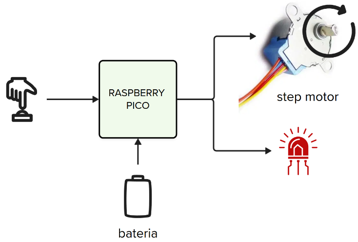

# GPIO - Prática

::::: center
:::: third
::: box-blue 1. Link para entrega 📦
Acessar [github classroom](https://....)
:::
::::
:::: third
::: box 2. Deadline
xx/08
:::
::::
:::: third
::: box Nota
50% da nota do laboratório
:::
::::
:::::

Nesse laboratório vocês irão aplicar os conceitos do pré lab (leitura e acionamento de um pino) para controlar um motor de passos. 

A ideia geral é que vocês possuam um botão, um LED e o motor de passos conectado na placa, toda vez que o botão for pressionado o LED deve acender e o motor girar 360 graus para uma direção de sua escolha. O sistema deve funcionar alimentado por bateria (não aceitaremos demos com ele ligado no PC).

:::tabs
== Montagem

== Vídeo
<YouTube id="xx529vCDUPM"/>
:::

Para isso, vocês vão precisar de:

| Bill of Materials               | Valor   |
|---------------------------------|---------|
| 1x Rasp pico                    | R$ 40   |
| 1x debug-probe                  | R$ 120  |
| 1x Motor de passos com driver   | R$ 18   |
| 1x Push buttons                 | R$ 0.20 |
| 1x LED (escolha a cor)          | R$ 0.1  |
| 1x Resistor entre 100 e 380 ohm | R$ ~    |

::: info Motor de passos
O motor de passos que iremos usar é o motor [28BYJ-48](https://www.makerhero.com/img/files/download/Datasheet_28BYJ-48.pdf) e alimentação de 5V e redução de 1/64, isto significa que é possível dar uma volta completa com 2048 passos, ou seja, apenas ~0,176° por passo. O motor precisa de um driver de potência para que possamos controlar via um microcontrolador, no caso iremos usar o [Uln2003](https://www.makerhero.com/img/files/download/ULN2003A-Datasheet.pdf).

No Brasil este motor custa em torno de R$18,00.

Refs:

- https://www.makerhero.com/produto/motor-de-passo-driver-uln2003-arduino/
- https://electrocredible.com/raspberry-pi-pico-stepper-control-uln2003-micropython/
:::

## Dicas

A seguir algumas dicas, você pode ou não seguir:

1. Comece colocando um LED e fazendo ele piscar!
1. Adicione o botão, e toda vez que ele for apertado pisque o LED.
1. Agora estude o básico sobre [motor de passos](https://howtomechatronics.com/tutorials/arduino/stepper-motors-and-arduino-the-ultimate-guide/).
1. Conecte o motor na placa e faca ele girar!
    - Use lógica similar ao `exe4` do pré lab.
1. Implemente o resto da lógica.

::: info
Não sabe como ligar um LED na placa? Acesse:

- https://projects.raspberrypi.org/en/projects/introduction-to-the-pico/7

Não sabe ligar um botão na placa? Acesse:

- https://projects.raspberrypi.org/en/projects/introduction-to-the-pico/10
:::

## Desafios extras

Gostou e quer fazer mais? Que tal:

- Colocar mais um botão e fazer girar para o outro lado
- Enquanto estiver girando e o botão for apertado, pare. Se apertado novamente, termine a rotação.
- Adicione mais LEDs e crie uma árvore de natal!
