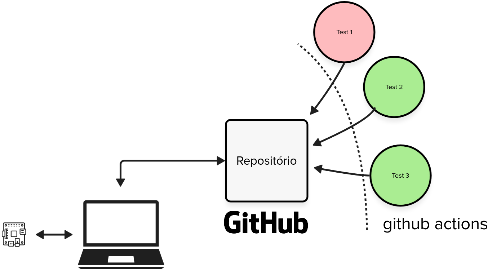

---
# https://vitepress.dev/reference/default-theme-home-page

hero:
  name: "Laboratórios" 
  tagline: "Entrega individual e semanal."
  actions:
    - theme: alt
      text: Qualidade de código
      link: /qualidade/
    - theme: alt
      text: Preparatório
      link: /labs/preparatorio
    - theme: alt
      text: Prática
      link: /labs/pratico

features:
  - title: Lab 1 - GPIO
    icon: ✅
    details: Entrada e saída digital
    link: /labs/gpio
  - title: Lab 2 - IRS
    icon: ➘
    details: Interrupção
    link: /labs/gpio
  - title: Lab 3 - Timer
    details: Contabilizando tempo
    link: /labs/gpio
---

# Laboratórios

Os laboratórios são compostos de duas entregas individuais: uma que deve acontecer até o dia do laboratório (chamada de pré lab) e outro que deve ser iniciada durante a aula (chamada de pra lab).

## Lab preparatório

As atividades de pré lab são compostas de duas frentes, uma que trata da qualidade de código em sistemas embarcados, e outro que lida com a parte de programacão do microcontrolador em um ambiente simulado. 

Para saber mais sobre cada uma das frentes, acesse:

- [Qualidade de código](/qualidade/)
- [Exercícios de programação](/labs/preparatorio)

## Lab prático

As atividades de laboratório prático demandam que vocês utilizem a placa física e apliquem o que foi estudado nas atividades preparatórias.

Para saber mais sobre a atividade prática acesse:

- [Pra lab](/labs/pratico)

## Funcionamento

Todos os códigos serão desenvolvido no computador do aluno e testados automáticamente no github. Todas as entregas devem ser realizados no github e publicadas no PrairieLearn.
