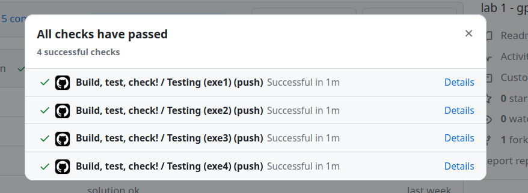

# Laboratórios preparatório

A disciplina utilizará atividades preparatórias que ajudarão vocês no desenvolvimento dos laboratórios. Essas atividades devem ser realizadas no VSCode e **não necessitam do uso da placa de desenvolvimento**. O objetivo é desacoplar um pouco os elementos; com o simulador, é possível praticar apenas o código e alguns aspectos da conexão de hardware, sem a complexidade de montar os componentes eletrônicos.

::: warning
Ao abrir o projeto, você deve importar o mesmo na extensão da rasp pico!!
:::

<iframe width="560" height="315" src="https://www.youtube.com/embed/io7dd_pljyY?si=mCdMRGZx0sN_rzgC" title="YouTube video player" frameborder="0" allow="accelerometer; autoplay; clipboard-write; encrypted-media; gyroscope; picture-in-picture; web-share" referrerpolicy="strict-origin-when-cross-origin" allowfullscreen></iframe>

## Testando exercícios

Esta entrega possui verificação automática. Para validar a entrega, envie o código para o seu repositório no GitHub e verifique o resultado do Actions. O sistema verifica:

- Se o código compila.
- Teste de unidade em cada código.
- Análise da qualidade de código:
    - cppcheck *(erros básicos de linguagem C)*
    - embedded-check *(erros conceituais de sistemas embarcados)*

Vocês devem obter o seguinte resultado no actions:

