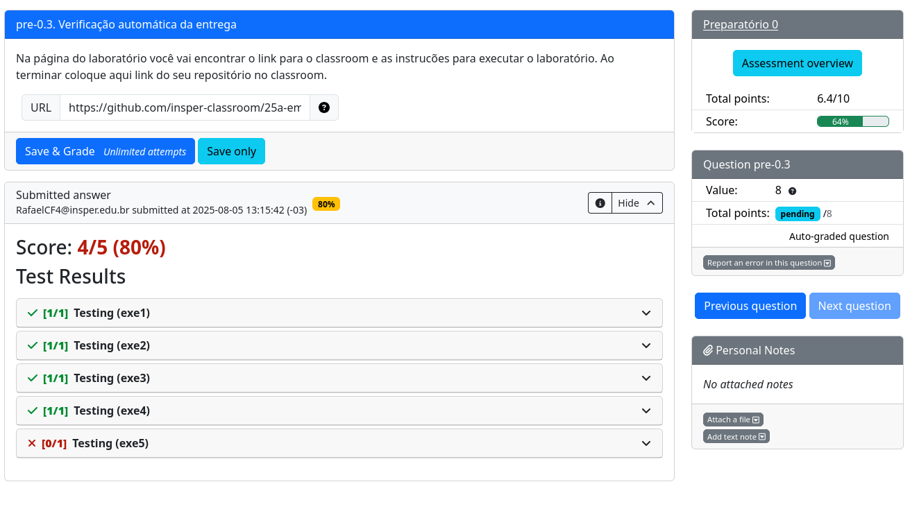

# Laboratório preparatório

::: info
Ao abrir o projeto, você deve importar o mesmo na extensão da Raspberry Pi Pico!
:::

<YouTube id="io7dd_pljyY"/>

## Testando exercícios

Esta entrega possui verificação automática. Para validar a entrega, envie o código para o seu repositório no GitHub e verifique o resultado do Actions. O sistema verifica:

- Se o código compila.
- Teste de unidade em cada código.
- Análise da qualidade de código:
    - cppcheck *(erros básicos de linguagem C)*
    - embedded-check *(erros conceituais de sistemas embarcados)*

Vocês devem obter o seguinte resultado no Actions:

## Enviando para avaliação

Após terminar os exercícios, o mesmo deve ser submetido para avaliação na plataforma do PrairieLearn, que irá utilizar o log do GitHub Actions e liberar a nota final da atividade. Para enviar a atividade, basta copiar o link do repositório do classroom e enviar para receber a nota.

::: danger Punição de atraso
As punições de atraso serão aplicadas automaticamente pelo PrairieLearn.

- -50% se entregue com até `dois dias de atraso`
- -70% se entregue com até `quatro dias de atraso`
- -100% se entregue após `quatro dias de atraso`
:::

